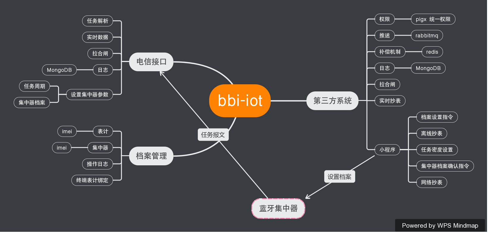
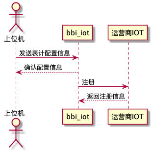

# 架构

# 生产软件

## 生产数据上传
| 帧头 | 内容 |
|-----|:---:|-----|
| 00 33 7B 22 | 62 68 22 3A 22 38 32 33 32 31 31 39 30 30 30 31 38 22 2C 22 49 4D 45 49 22 3A 22 38 39 38 36 30 34 30 37 31 31 31 38 43 30 37 34 36 32 37 30 22 7D |
| 3 | {"bh":"823211900018","IMEI":"898604071118C0746270"} |

1. 上送到关系到bbi-iot 平台
2. 4个字节长度+{"bh":"823211900018","imei":"898604071118C0746270","sim":1223455666,"iottype":1}
3. 4个字节长度+{"imei":"898604071118C0746270","sim":1223455666,"iottype":1,"zd":"1111111"} 
	1. iottype：1：电信，2：移动 3：联通
	2. zd：如果是8位就是376常规集中器，如果是12位表明位645的集中器
	3. json 内容中有 zd 内容，说明上送的是一个集中器，如果有 bh 内容说明上送的是电表内容，两者不会同时出现

## 运营商IOT 注册
需要设计个消息队列（存放上位机传上来的需求）
上位机-->bbiiot-->运营商 iot

表结构设计

| bh | zd | sim | imei    | iottype | 第三方 appid  |iot-deviceid  | registertime | unregistertime |
|-------|:---:|-----------|-------:|-------:|-------:|-------:|-------:|-------:|
| 1213  | 384 | robot     | 1 |
| 121233 | .3  | bird      | 1   |
| 123  | ?   | undefined | 0     |

# 小程序功能

集中器电表模式

电表模式
- [ ] 待续

## 获取档案设置报文

> 功能：配置档案信息
> 控制码：C=30H
> 数据域长度：L=档案数*8+6
> 帧格式：
---
| 68H | A0 | .. | A5 | 68H | 30H | LL  | MM  | WW  | NN…NN  | CS  | 16H |
|-------|:---:|---------|-------:|-------:|-------:|-------:|-------:|-------:|-------:|-------:|-------:|
---
| 类型 | 说明                       | 字节长度            |
| ---- | -------------------------- | ------------------- |
| MM： | 01H--增加；00H--删除       | 1                   |
| WW： | 档案数（最大为8）          | 1                   |
| NN： | （6字节表号+2字节备用）*WW | 8*WW		备用字节补00H |

---						
数据认证方式：
    密钥默认为123456					
	将12H、34H、56H与MM区、WW区和NN区进行16位CRC计算，得到的结果					
	高字节在前，低字节在后放于EE区					

### 获取档案解析报文

- [ ] 待续

# BBI-IOT 报文
## 任务上送报文
## 冻结数据补招
## 拉合闸报文（645）
## 设置报文（645）
### 设置时钟（645）
### 设置复费率（645）
### 数据清零（645）

# 第三方系统定义
## 权限定义
## 数据订阅
回调
## 任务推送
定时推送订阅的数据
### 失败补偿机制