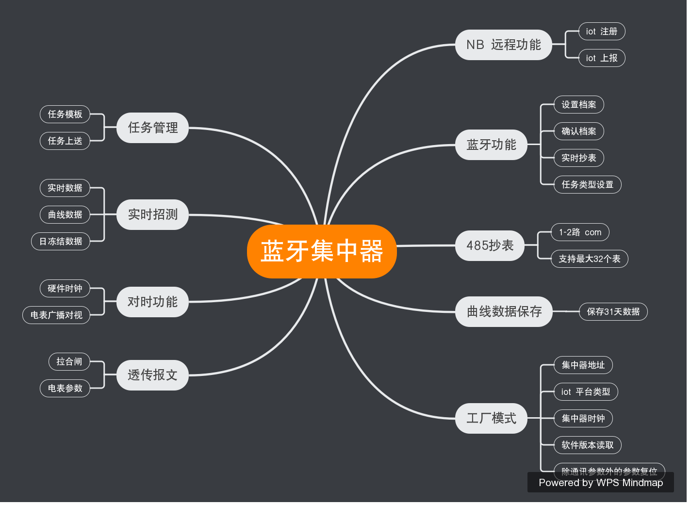
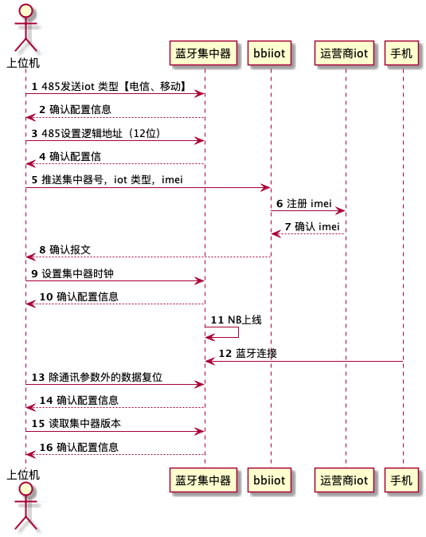

# 脑图

# NB 远传功能
集中器具有NBiot（电信）接入功能
电信卡要设置成常在线模式  psm0模式
# 档案设置
集中器具有蓝牙接口，可以提供外围设置功能
具备增删档案功能

# 485抄表功能
- 需要支持1-2路com 口抄表。
- 最大支持32个表

# 任务管理
- 任务分为3类，1小时任务（4条15分钟曲线）；2小时任务（4条30分钟曲线）；4小时任务（4条1小时数据）

>1-8只表任务是1小时任务
>9-16只表任务是2小时任务
>17-32只表任务是4小时任务
 默认是2小时任务
- 任务模板
  0268FFFF
<pre><code>
Array[4]
  {
XXXXXXXXXX(时间，5字节) [时间是整分]
XXXXXXXX(表计运行状态)
XXXXXXXX(事件状态)
XXX.X(A相电压2字节)
XXX.X(B相电压2字节)
XXX.X(C相电压2字节)
XXX.XXX(A相电流3字节)
XXX.XXX(B相电流3字节)
XXX.XXX(C相电流3字节)
XXX.XXX(剩余电流，3字节)
XX.XXXX(总有功功率3字节,最高位为符号位)
XX.XXXX(A相有功功率3字节,最高位为符号位)
XX.XXXX(B相有功功率3字节,最高位为符号位)
XX.XXXX(C相有功功率3字节,最高位为符号位)
XX.XXXX(总无功功率3字节,最高位为符号位)
XX.XXXX(A相无功功率3字节,最高位为符号位)
XX.XXXX(B相无功功率3字节,最高位为符号位)
XX.XXXX(C相无功功率3字节,最高位为符号位)
X.XXX(总功率因数2字节,最高位为符号位)
X.XXX(A相功率因数2字节,最高位为符号位)
X.XXX(B相功率因数2字节,最高位为符号位)
X.XXX(C相功率因数2字节,最高位为符号位)
XXXXXX.XX(正向有功总电量，4字节)
XXXXXX.XX(正向有功费率1电量，4字节)
XXXXXX.XX(正向有功费率2电量，4字节)
XXXXXX.XX(正向有功费率3电量，4字节)
XXXXXX.XX(正向有功费率4电量，4字节)
XXX.X(A相温度)
XXX.X(B相温度)
XXX.X(C相温度)
XXX.X(零线温度)
XXX.X(环境温度)
XXXXXXXXXXXX(保留6字节，默认为全0)
}
</code></pre>

# 实时招测
- 读取当前实时数据及事件上报数据（上送控制字为0x11）
标识ID：
0269FFFF
<pre><code>
XXXXXXXXXXXX(时间)
XXXXXXXX(表计运行状态)
XXXXXXXX(事件状态)
XXX.X(A相电压2字节)
XXX.X(B相电压2字节)
XXX.X(C相电压2字节)
XXX.XXX(A相电流3字节)
XXX.XXX(B相电流3字节)
XXX.XXX(C相电流3字节)
XXX.XXX(剩余电流，3字节)
XX.XXXX(总有功功率3字节,最高位为符号位)
XX.XXXX(A相有功功率3字节,最高位为符号位)
XX.XXXX(B相有功功率3字节,最高位为符号位)
XX.XXXX(C相有功功率3字节,最高位为符号位)
XX.XXXX(总无功功率3字节,最高位为符号位)
XX.XXXX(A相无功功率3字节,最高位为符号位)
XX.XXXX(B相无功功率3字节,最高位为符号位)
XX.XXXX(C相无功功率3字节,最高位为符号位)
X.XXX(总功率因数2字节,最高位为符号位)
X.XXX(A相功率因数2字节,最高位为符号位)
X.XXX(B相功率因数2字节,最高位为符号位)
X.XXX(C相功率因数2字节,最高位为符号位)
XXXXXX.XX(正向有功总电量，4字节)
XXXXXX.XX(正向有功费率1电量，4字节)
XXXXXX.XX(正向有功费率2电量，4字节)
XXXXXX.XX(正向有功费率3电量，4字节)
XXXXXX.XX(正向有功费率4电量，4字节)
XXX.X(A相温度)
XXX.X(B相温度)
XXX.X(C相温度)
XXX.X(零线温度)
XXX.X(环境温度)
XXXXXXXXXXXX(保留6字节，默认为全0)
</code></pre>
- 读取当前曲线数据（上送控制字为0x11）
标识ID：
0669FFFF
<pre><code>
XXXXXXXXXXXX(时间)
XXXXXXXX(表计运行状态)
XXXXXXXX(事件状态)
XXX.X(A相电压2字节)
XXX.X(B相电压2字节)
XXX.X(C相电压2字节)
XXX.XXX(A相电流3字节)
XXX.XXX(B相电流3字节)
XXX.XXX(C相电流3字节)
XXX.XXX(剩余电流，3字节)
XX.XXXX(总有功功率3字节,最高位为符号位)
XX.XXXX(A相有功功率3字节,最高位为符号位)
XX.XXXX(B相有功功率3字节,最高位为符号位)
XX.XXXX(C相有功功率3字节,最高位为符号位)
XX.XXXX(总无功功率3字节,最高位为符号位)
XX.XXXX(A相无功功率3字节,最高位为符号位)
XX.XXXX(B相无功功率3字节,最高位为符号位)
XX.XXXX(C相无功功率3字节,最高位为符号位)
X.XXX(总功率因数2字节,最高位为符号位)
X.XXX(A相功率因数2字节,最高位为符号位)
X.XXX(B相功率因数2字节,最高位为符号位)
X.XXX(C相功率因数2字节,最高位为符号位)
XXXXXX.XX(正向有功总电量，4字节)
XXXXXX.XX(正向有功费率1电量，4字节)
XXXXXX.XX(正向有功费率2电量，4字节)
XXXXXX.XX(正向有功费率3电量，4字节)
XXXXXX.XX(正向有功费率4电量，4字节)
XXX.X(A相温度)
XXX.X(B相温度)
XXX.X(C相温度)
XXX.X(零线温度)
XXX.X(环境温度)
</code></pre>
- 读取最近一次日冻结数据（上送控制字为0x11）
标识ID：
0569FFFF
<pre><code>
XXXXXXXXXXXX(时间)
XXXXXXXX(表计运行状态)
XXXXXXXX(事件状态)
XXX.X(A相电压2字节)
XXX.X(B相电压2字节)
XXX.X(C相电压2字节)
XXX.XXX(A相电流3字节)
XXX.XXX(B相电流3字节)
XXX.XXX(C相电流3字节)
XXX.XXX(剩余电流，3字节)
XX.XXXX(总有功功率3字节,最高位为符号位)
XX.XXXX(A相有功功率3字节,最高位为符号位)
XX.XXXX(B相有功功率3字节,最高位为符号位)
XX.XXXX(C相有功功率3字节,最高位为符号位)
XX.XXXX(总无功功率3字节,最高位为符号位)
XX.XXXX(A相无功功率3字节,最高位为符号位)
XX.XXXX(B相无功功率3字节,最高位为符号位)
XX.XXXX(C相无功功率3字节,最高位为符号位)
X.XXX(总功率因数2字节,最高位为符号位)
X.XXX(A相功率因数2字节,最高位为符号位)
X.XXX(B相功率因数2字节,最高位为符号位)
X.XXX(C相功率因数2字节,最高位为符号位)
XXXXXX.XX(正向有功总电量，4字节)
XXXXXX.XX(正向有功费率1电量，4字节)
XXXXXX.XX(正向有功费率2电量，4字节)
XXXXXX.XX(正向有功费率3电量，4字节)
XXXXXX.XX(正向有功费率4电量，4字节)
XXX.X(A相温度)
XXX.X(B相温度)
XXX.X(C相温度)
XXX.X(零线温度)
XXX.X(环境温度)
</code></pre>

# 对时管理
- 集中器具有硬件时钟功能
- 集中器能够定时对电表进行广播对时
# 曲线数据
- 集中器保留最近31天的曲线数据

# 透传报文
## 拉合闸功能
- 1A 拉闸
- 1C 合闸

# 上位机软件需求

1. 设置主站类型（移动：ip，电信：ip）
2. 配置集中器地址
   1. 上送到关系到bbi-iot 平台
   2. 4个字节长度+{"bh":"823211900018","imei":"898604071118C0746270","sim":1223455666,"iottype":1}
   3. 4个字节长度+{"imei":"898604071118C0746270","sim":1223455666,"iottype":1,"zd":"1111111"} 
      1. iottype：1：电信，2：移动 3：联通
      2. zd：如果是8位就是376常规集中器，如果是12位表明位645的集中器
      3. json 内容中有 zd 内容，说明上送的是一个集中器，如果有 bh 内容说明上送的是电表内容，两者不会同时出现

3. 设置集中器时钟
4. NB上线
   1. 看运行灯来判断在线状态
5. 蓝牙链接
   1. 手机查看能否连接
6. 除通讯参数外的数据复位
7. 读取集中器版本
